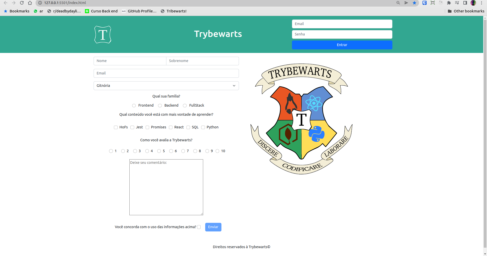

## O que é o projeto TrbyeWarts: 

O objetivo deste projeto foi elaborar um formulário dinâmico com javascript, aprimorando os conhecimentos de tags semânticas de HTML, manipulação de elementos do DOM, e estilização com bootstrap. 

## Exemplo:

